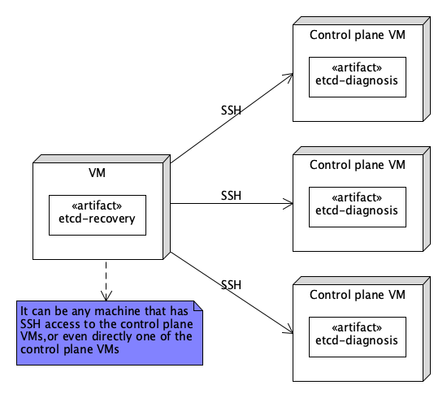

# etcd-recovery

Recovering etcd clusters can be manual, time-consuming, and error-prone. **etcd-recovery** is a generic tool
that simplifies and automates the recovery process, even when quorum is lost, helping engineers restore
etcd clusters safely and efficiently. See the detailed usage below.

```
$ ./etcd-recovery -h
A tool to automatically recover an etcd cluster when quorum is lost

Usage:
  etcd-recovery [command]

Available Commands:
  completion  Generate the autocompletion script for the specified shell
  exec        Excecute command against host(s)
  help        Help about any command
  repair      Perform etcd repair operations
  select      Select the best member to recover the cluster from
  version     Prints the version of etcd-recovery

Flags:
  -e, --command string   command to execute against target host(s)
  -c, --config string    path to etcd cluster hosts config file (default "hosts.json")
  -h, --help             help for etcd-recovery
  -m, --mode string      etcd cluster repair mode, valid modes are: [add create both] (default "both")
  -v, --verbose          enable verbose output

Use "etcd-recovery [command] --help" for more information about a command.
```

## Recovery Workflow

Below is the generic workflow for recovering an etcd cluster, and etcd-recovery automates the workflow, making
recovery faster and more reliable.

Although the diagram below provides a visual overview of the workflow, the process can be summarized succinctly
as follows: initialize a new single-member cluster with `--force-new-cluster`, and then add the remaining members
back to the cluster one by one.

[View the recovery workflow diagram](./docs/workflow.png)

## Deployment Architecture

`etcd-recovery` relies on [etcd-diagnosis](https://github.com/vmware/etcd-diagnosis) to identify the best member
from which to recover the etcd cluster. It checks each control plane VM for `etcd-diagnosis` in the user’s home
directory and automatically installs it if not present.

The high-level deployment architecture is shown below.



## Configuration

Define all control plane VMs that will ultimately become members of the recovered etcd cluster in a `hosts.json` file.
The file contains fields listed below. For each VM, specify a `username` (required) and either a `password` or a
`privateKey` for SSH access. The `password` and `privateKey` are mutually exclusive.

| Field Name       | Description                                                                                                                                                                                                                   |
|------------------|-------------------------------------------------------------------------------------------------------------------------------------------------------------------------------------------------------------------------------|
| name             | A human-readable and memorable identifier                                                                                                                                                                                     |
| member_name      | The unique name assigned to the etcd member. This value corresponds to the `--name` flag in the `/etc/kubernetes/manifests/etcd.yaml` file on each control plane VM. **Optional**; if not set, defaults to the VM's hostname. |
| host             | The IP address of the control plane VM                                                                                                                                                                                        |
| username         | Username to SSH into the control plane VM                                                                                                                                                                                     |
| password         | Password to SSH into the control plane VM                                                                                                                                                                                     |
| privateKey       | Path to the private key used to SSH into the control plane VM. **Mutually exclusive** with `password`.                                                                                                                        |
| backedUpManifest | The path to the backed-up etcd manifest on the control plane VM, i.e. `/root/etcd.yaml`                                                                                                                                       |

Example:
```
[
    {
        "name": "etcd-vm1",
        "host": "10.100.72.7",
        "username": "root",
        "password": "changeme",
        "backedup_manifest": "/root/etcd.yaml"
    },
    {
        "name": "etcd-vm2",
        "host": "10.100.72.8",
        "username": "root",
        "password": "changeme",
        "backedup_manifest": "/root/etcd.yaml"
    },
    {
        "name": "etcd-vm3",
        "host": "10.100.72.9",
        "username": "root",
        "password": "changeme",
        "backedup_manifest": "/root/etcd.yaml"
    }
]
```

## Recovery Steps

### Prerequisite: Data Backup

It's always considered best practice to back up all relevant data before performing a recovery, including the etcd data directory
(typically `/var/lib/etcd/`) and the manifest file (`/etc/kubernetes/manifests/etcd.yaml`).

Note:
- If the Kubernetes is managed by an cluster lifecycle management tool (i.e. Cluster API), pause the cluster's
  reconciliation process to prevent it from automatically recreating the control plane nodes. Remember to
  unpause it after the recovery is complete.
- Before taking a backup, stop the etcd on each control plane VM by moving the manifest file (`/etc/kubernetes/manifests/etcd.yaml`)
  to another location, for example, `~/etcd.yaml`. This will cause kubelet to stop the etcd container automatically.
- etcd-recovery requires the [etcd-diagnosis](https://github.com/vmware/etcd-diagnosis) tool. Please download the etcd-diagnosis and
  put the binary in the same directory as etcd-recovery.

### Step 1: Prepare the configuration file

List all control plane VMs that will participate in the recovered etcd cluster in a `hosts.json` file. See the example above.

### Step 2: Select the best member for recovery

Run the command below to identify the VM with the highest `commit-index`. This VM will be used in the next step.

> Note: All `etcd-recovery` commands read `./hosts.json` by default if the `--host` flag is not specified.
You only need to specify `--host` if using a different file.

```
$ etcd-recovery select -v --host hosts.json
```

### Step 3: Repair the cluster

Run command below to recover the cluster. You only need to interactively select a node to recover from;
the tool will automatically create a single-member cluster from the selected node and add all other nodes
into the cluster.

```
$ etcd-recovery repair -v
```

Alternatively, you can also break the process into multiple steps:

- Create a single-member cluster

Run the following command and interactively select a node to recover from.
```
$ etcd-recovery repair -v --mode create
```

- Add remaining members

For each additional member, run:
```
$ etcd-recovery repair -v --mode add
```
During each run, you will be prompted to provide:
- The node name of the initial member used to create the single-member cluster (e.g., etcd-vm1)
- The node name of the new member to be added (e.g., etcd-vm2)

Repeat the add step until all remaining members have been added to the cluster.
